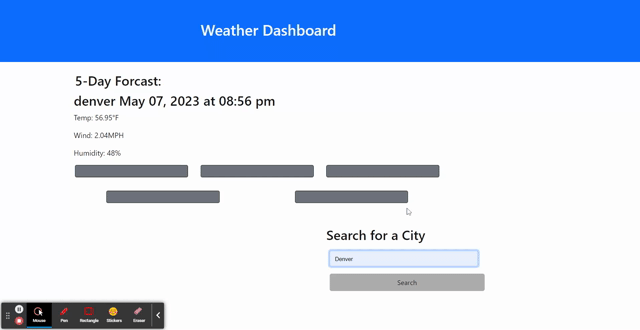

# Weather Dashboard

This is a weather dashboard that allows users to search for a city and view current and future weather conditions for that city. The weather data is retrieved from the OpenWeatherMap API and is dynamically displayed using HTML and CSS.

## User Story

```
AS A traveler
I WANT to see the weather outlook for multiple cities
SO THAT I can plan a trip accordingly
```

## Technologies Used

- HTML
- CSS
- JavaScript
- OpenWeatherMap API

## Features

- Search for weather data for any city
- View current and future weather conditions for a city
- View a search history list of previously searched cities
- Click on a city in the search history list to view its weather data again

## Installation

To use this WeatherWhere, you need to have a web browser installed on your computer.

1. Clone the repository to your local machine using `https://github.com/DaverCodes/WeatherWhere-`.
2. Open the `index.html` file in a web browser.

## Usage

<a href="./Assets/checktheweatha.gif"></a>


1. Enter a city name in the search bar and click on the search button.
2. The current weather conditions and a 5-day forecast for the city should be displayed.
3. The city should be added to the search history list.
4. Clicking on a city in the search history list should allow you to view its weather info.

## Credits

This project was created by https://github.com/DaverCodes. 

The weather data is retrieved from the [OpenWeatherMap API](https://openweathermap.org/api).

## License

This project is licensed under the [MIT License](https://opensource.org/licenses/MIT).